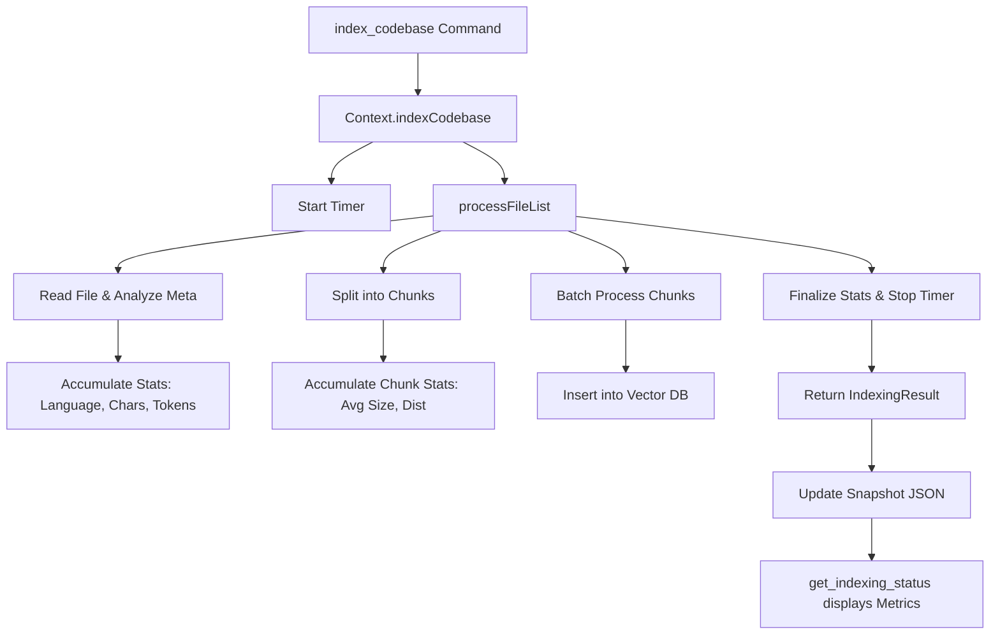

# Technical Implementation Plan: Enriched Indexing Status

This plan outlines the changes required to enhance the `get_indexing_status` command in the `gemini-code-intel` MCP server with performance metrics and advanced structural metadata.

## 1. Metadata Schema Enhancements

### `packages/mcp/src/config.ts`
Update `CodebaseInfoIndexed` to include the new data points.

```typescript
export interface CodebaseInfoIndexed extends CodebaseInfoBase {
    status: 'indexed';
    indexedFiles: number;
    totalChunks: number;
    indexStatus: 'completed' | 'limit_reached';
    lastUpdated: string;
    // New metrics
    performance?: {
        totalElapsedTimeMs: number;
    };
    metadata?: {
        languageBreakdown: Record<string, number>;
        totalCharacters: number;
        totalTokens: number;
        chunkingTelemetry: {
            averageChunkSize: number;
            chunkSizeDistribution: Record<string, number>; // e.g., "0-500": 100, "501-1000": 250, etc.
        };
    };
}
```

### `packages/core/src/types.ts`
Define an `IndexingResult` interface to be returned by the core indexing process.

```typescript
export interface IndexingResult {
    indexedFiles: number;
    totalChunks: number;
    status: 'completed' | 'limit_reached';
    totalElapsedTimeMs: number;
    languageBreakdown: Record<string, number>;
    totalCharacters: number;
    totalTokens: number;
    averageChunkSize: number;
    chunkSizeDistribution: Record<string, number>;
}
```

## 2. Core Indexing Instrumentation

### `packages/core/src/context.ts`

#### `indexCodebase`
1. Capture `startTime = Date.now()`.
2. Wrap `processFileList` call to capture elapsed time.
3. Update return type to match `IndexingResult`.

#### `processFileList`
1. Initialize accumulators:
    - `languageBreakdown: Record<string, number> = {}`
    - `totalCharacters = 0`
    - `totalTokens = 0`
    - `chunkSizeDistribution: Record<string, number> = { "0-500": 0, "501-1000": 0, "1001-2000": 0, "2000+": 0 }`
    - `sumChunkSizes = 0`
2. For each file processed:
    - Increment `languageBreakdown[ext]`.
    - Add `content.length` to `totalCharacters`.
    - Calculate tokens (using existing estimation logic) and add to `totalTokens`.
3. For each chunk generated:
    - Increment appropriate bucket in `chunkSizeDistribution`.
    - Add `chunk.content.length` to `sumChunkSizes`.
4. Return enriched statistics along with `processedFiles` and `totalChunks`.

## 3. MCP Handler & Snapshot Updates

### `packages/mcp/src/snapshot.ts`
Update `setCodebaseIndexed` to accept the full `IndexingResult` and store it in the `CodebaseInfoIndexed` object.

### `packages/mcp/src/handlers.ts`
1. Update `startBackgroundIndexing` to receive the full `IndexingResult` from `context.indexCodebase`.
2. Pass the full result to `snapshotManager.setCodebaseIndexed`.
3. Update `handleGetIndexingStatus` to format and display the new metrics:
    - **Performance**: Show time in seconds/minutes.
    - **Codebase Composition**: List top 5 languages and their file counts.
    - **Size**: Show total characters and estimated tokens.
    - **Chunking**: Show average chunk size and distribution.

## 4. Proposed Metadata Storage Workflow



## 5. Verification Plan
- Run `index_codebase` on a sample repository.
- Inspect the generated `mcp-codebase-snapshot.json` to ensure new fields are present and accurate.
- Call `get_indexing_status` and verify the output formatting.
